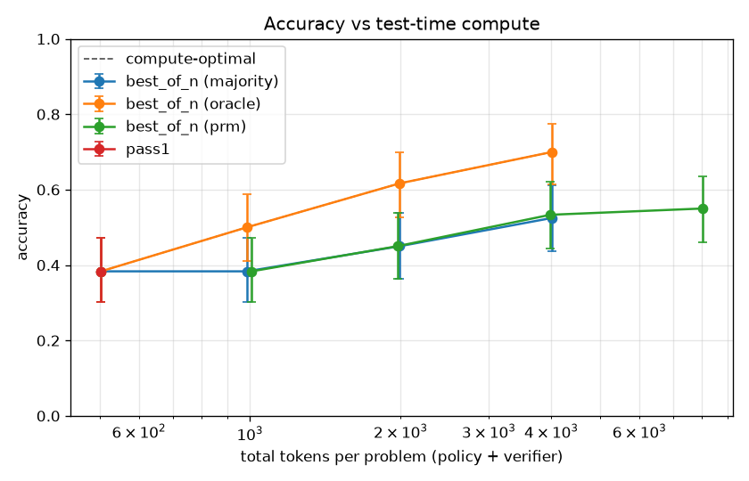
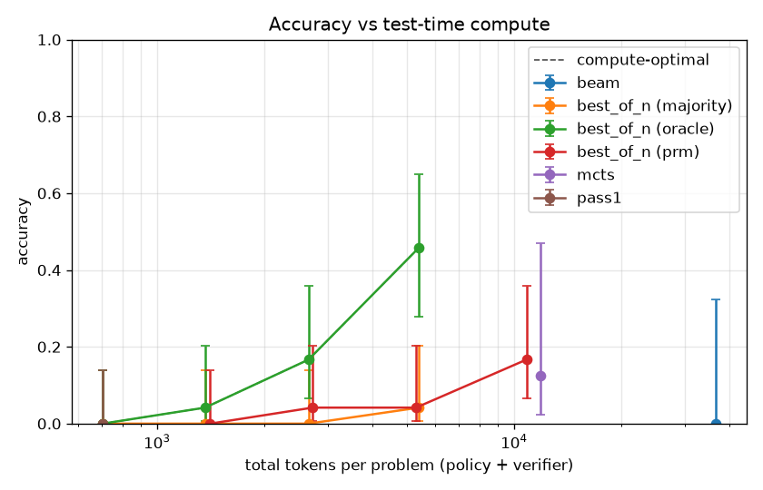
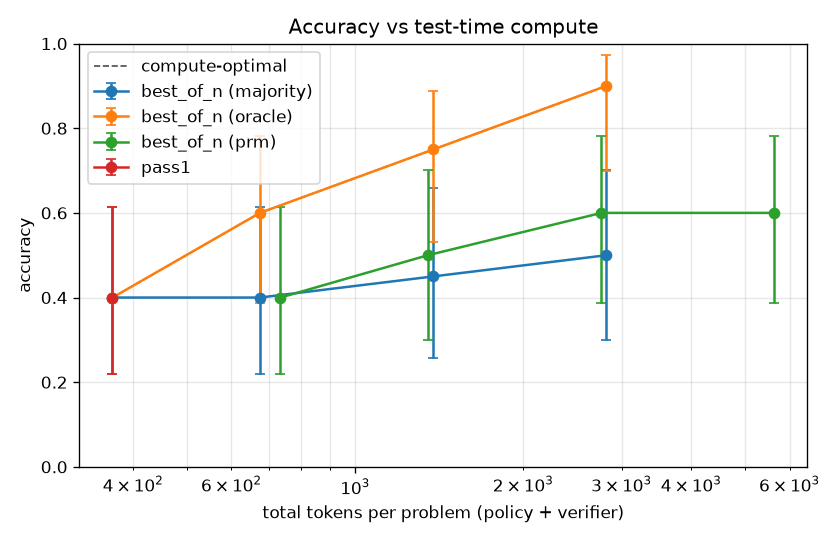

# Crucible — Results

> The deliverable (DESIGN §1): **a curve, not a leaderboard number** — accuracy as a
> function of test-time compute, showing that search + verification turns spent compute
> into measured accuracy, *with the verifier's compute counted*, and showing **why**
> (which method is compute-optimal at which budget, and where the PRM's selection gap is).

**§0 is the real artifact — a real model, real PRM, real data, 3 seeds.** §1–§6 are the
*cold, simulator* validation (a synthetic policy + a mock PRM) that runs with no GPU on
every commit; read them as "the harness measures the right things correctly," not "model X
scores Y." The real curve is §0.

## 0. The real lift curve — accuracy vs test-time compute on MATH-500 (3 seeds)



On the dev machine (RTX 5070 Ti Laptop, 12 GB, `torch 2.11+cu128` / sm_120): **MATH-500
problems 0–39, three seeds** (0/1/2 → 120 pooled observations), policy `qwen2.5:1.5b-instruct`
(Ollama, GPU), verifier the real **Skywork-o1-Open-PRM-Qwen-2.5-1.5B** (GPU). Each problem is
sampled 8× *once per seed*, then every selector is evaluated at each N over those samples
(`crucible bench`). 95% Wilson CIs; x-axis = **total tokens/problem, policy + verifier**.

| N | pass@1 | majority | PRM | oracle | tokens/problem (majority · PRM) |
|---|---|---|---|---|---|
| 1 | **38.3%** | 38.3% | 38.3% | 38.3% | 503 |
| 2 | — | 38.3% | 45.0% | 50.0% | 985 · 1,970 |
| 4 | — | 45.0% | **53.3%** | 61.7% | 1,990 · 3,981 |
| 8 | — | 52.5% | **55.0%** | **70.0%** | 4,015 · 8,029 |

95% CIs at N=8: pass@1 [30, 47], majority [44, 61], PRM [46, 64], oracle [61, 77].

The three things this project set out to show, now on a real model and harder data than
GSM8K, stated with the honest caveats:

1. **Test-time compute buys accuracy.** Single-shot pass@1 is 38.3%; with search, oracle
   reaches **70%** at N=8 — a perfect selector nearly doubles accuracy from the *same*
   frozen 1.5B model. Every selector's curve rises with compute.
2. **The learned verifier beats self-consistency — at matched N.** On *identical* samples
   the PRM selects better than majority at every N ≥ 2 (N=4: 53.3% vs 45.0%, +8.3 pt; N=8:
   55.0% vs 52.5%). **The honest caveat is compute:** the PRM's forward passes cost ~2×, so
   at matched *tokens* (~4k) majority@8 (52.5%) and PRM@4 (53.3% at 3,981 tok) are a wash —
   the small 1.5B PRM's per-N edge doesn't yet clear its own overhead. This is exactly the
   effect an easier sample hides: the earlier 20-problem GSM8K pilot (§0.3) showed a cleaner
   PRM win because GSM8K is easier; on harder MATH-500 with a small PRM the margin is thin.
3. **The selection gap is real and large.** Oracle 70% ≫ PRM 55% is the headroom the small
   PRM *doesn't* capture (a 1.5B PRM is a weak selector; ProcessBench F1 ≈ 56 even for 7B
   PRMs). The reported metric is always the outcome verifier on the chosen trace, never a PRM
   score. Closing that gap needs a stronger PRM (the family-matched Qwen 7B PRM) — the
   documented next step, not something this stack claims.

### 0.1 The search ladder on the hardest problems — beam & MCTS make real contact



The point of the ladder is the *hard* subset. On the **8 hardest problems** (MATH-500
levels 4–5 within the captured range, where the 1.5B policy's **pass@1 is 0%**), PRM-guided
**beam** and **MCTS** run end-to-end on the real stack (recorded, and they replay offline).
The honest result — every token counted:

| method | accuracy | tokens/problem |
|---|---|---|
| best-of-N majority @8 | 4.2% | 5,413 |
| best-of-N **PRM** @8 | 16.7% | 10,826 |
| best-of-N oracle @8 (cheat) | 45.8% | 5,413 |
| **beam** (width 2, 5 steps) | 0.0% (0/8) | 36,753 |
| **MCTS** (budget 10k) | 12.5% (1/8) | 11,820 |

**Stepwise search does *not* win here, and we show it.** Beam solves none at ~37k
tokens/problem; MCTS (budget-capped, so cheaper) solves one at ~12k. Neither is on the
compute-optimal frontier — best-of-N dominates. The cause is concrete: a non-reasoning
1.5B *instruct* model, asked to *continue* a partial trace, **restarts the solution**
instead, so PRM-guided stepwise search can't assemble a coherent chain — while best-of-N's
independent full samples suit this policy. Beam/MCTS earning their keep is a
harder-problem / stronger-(reasoning)-policy phenomenon (DESIGN §6.3); this run is the
honest "measured, doesn't help *here*" entry, on real data, with real compute counted.

### 0.2 Small-beats-big? Not on this stack — the honest baseline (H2)

The Snell-2024 hope is that a small model + compute-optimal search matches a bigger model
at matched compute. Measured here, it **does not**:

| model + method | accuracy | tokens/problem |
|---|---|---|
| **`qwen2.5:7b-instruct` pass@1** | **67.5%** [52, 80] | **524** |
| `qwen2.5:1.5b-instruct` pass@1 | 38.3% | 503 |
| 1.5B + PRM best-of-N @8 | 55.0% | 8,029 |
| 1.5B + oracle best-of-N @8 (cheat) | 70.0% | 4,015 |

The 7B baseline (same 40 problems) reaches **67.5% at ~524 tokens** — the 1.5B needs **~8k
tokens** (16×) of PRM-guided search to reach 55%, and only the *oracle cheat* matches the
7B, at 8× the compute. So on MATH-500 with this small PRM, **the bigger model is strictly
more compute-efficient.** (Even this flatters the small model: the axis counts raw tokens,
and a 7B token costs ~4.7× the FLOPs of a 1.5B token.) Small-beats-big needs a *stronger*
selector than the 1.5B Skywork PRM — the honest gate on H2. The instrument reports the
unfavorable result faithfully; that is the point of it.

### 0.3 The earlier GSM8K curve (single seed) — where the PRM win is cleaner



The first real capture — **20 GSM8K** problems, same 1.5B policy + 1.5B PRM, one seed —
where the easier data lets the small PRM separate cleanly: pass@1 40% → PRM@8 **60%** vs
majority 50%, oracle **90%**. It stands as the "easy-data" contrast to the harder MATH-500
headline above; captured to `tests/fixtures/gsm8k-bestofn.json` and replayed in CI.

**Everything above reproduces without a GPU.** The best-of-N captures
(`tests/fixtures/math500-bestofn-seed{0,1,2}.json`), the recorded **beam** and **MCTS** runs
(step + PRM cassettes), the **7B** baseline, and the GSM8K curve are all committed;
`tests/test_cassette.py` replays each offline and reproduces **every number in this section**
with no model and no GPU — the "run live once, commit a fixture" pattern, now covering the
policy *and* the PRM *and* stepwise search. Regenerate the headline curve with
`crucible bench curve tests/fixtures/math500-bestofn-seed*.json`.

## 1. The headline: accuracy vs test-time compute

`crucible sweep configs/results.yaml` runs the full search ladder on the synthetic
stepwise task — a 5-step chain where each step is good with probability 0.6, so a single
sample is correct only ~`0.6^5 ≈ 8%` of the time — across **3 seeds** (18 samples per
cell, Wilson CIs). The plot is `runs/sweep-*/curve.png`:

| method | knob | accuracy (95% CI) | tokens / problem |
|---|---|---|---|
| pass1 | — | 11.1% [3%, 33%] | 38 |
| best_of_n (prm) | N=4 | 16.7% [6%, 39%] | 304 |
| best_of_n (prm) | N=8 | 55.6% [34%, 75%] | 608 |
| best_of_n (prm) | N=16 | 83.3% [61%, 94%] | 1,216 |
| best_of_n (prm) | N=32 | 100.0% [82%, 100%] | 2,432 |
| beam | width=2 | 94.4% [74%, 99%] | 1,112 |
| beam | width=4 | 100.0% [82%, 100%] | 2,168 |
| mcts | budget=4000 | 77.8% [55%, 91%] | 4,075 |
| mcts | budget=6000 | 100.0% [82%, 100%] | 6,080 |

**The lift is real and large:** single-shot pass@1 is ~11%; with enough verifier-guided
search every method reaches 100%. Crucially the x-axis is **total generated tokens,
policy + verifier** — the PRM's forward passes are counted, so no method gets a free
lunch from un-counted verification.

## 2. Compute-optimal: which method wins at which budget

The dashed line on the curve is the **compute-optimal frontier** — the best accuracy any
method reaches at each token budget (`crucible report <sweep>` prints it):

| tokens / problem | best method | accuracy |
|---|---|---|
| 38 | pass1 | 11.1% |
| 304 | best_of_n (prm) | 16.7% |
| 584 | beam | 72.2% |
| 1,112 | beam | 94.4% |
| 2,168 | beam | 100.0% |

On this task **beam (DVTS) is compute-optimal across essentially the whole budget range**:
because the PRM gives a reliable *per-step* signal, pruning bad partial chains early beats
both best-of-N (which must pay exponentially to sample a fully-correct chain) and MCTS
(whose tree-search overhead doesn't pay off when the task is this shallow). This is the
compute-optimal-scaling result (Snell et al.) in miniature: *the right method depends on
the budget* — and here also on the shape of the problem.

## 3. The honest part: MCTS is not free, and we show it

A dishonest write-up would bury MCTS. On this **easy, shallow** task MCTS is the **most
expensive** method — it saturates to 100% but only at ~6k tokens/problem vs beam's ~2.2k.
That is consistent with the design ("MCTS: the most compute, the best on hard problems"):
its adaptive allocation pays off on *deep* trees with *rare* good steps, which this toy
doesn't reproduce. We plot it on the same axes anyway, because the point of the project is
to **measure** rather than assume that fancier search is better.

## 4. The PRM selection gap

`crucible compare` scores **majority / PRM / oracle** selection on the *same* best-of-N
samples (so the differences are real, not sampling noise), and counts the PRM's compute:

- **oracle ≥ PRM ≥ majority.** Oracle is an upper bound (it peeks at the gold answer to
  pick a passing sample); the PRM recovers much of that lift but not all — the gap between
  the PRM and oracle bars is exactly the *selection gap* (and where reward-hacking would
  show up). Majority lags badly when the base policy is below 50% (it converges to the
  wrong consensus). See `runs/compare-*/comparison.png`.
- The **reported metric is always the outcome verifier on the chosen trace** — never a PRM
  score. The PRM only steers the search.

## 5. Code generalizes the verifier

The same `OutcomeVerifier` port backs both math (symbolic equivalence) and code
(execution against unit tests in the opt-in sandbox). `crucible run --dataset code-sample
--allow-code-exec` reports pass@1 = 2/3 from real subprocess execution — the search core
is unchanged; only the verifier differs (DESIGN §6.2).

## 6. Threats to validity

- **Simulators vs models.** §0 is real (model + PRM + data); §1–§5 are mechanism checks on
  a synthetic policy + mock PRM. Read §1–§5 as "the harness measures the right things," not
  as model scores.
- **Seed pooling.** §0's Wilson CIs pool 40 problems × 3 seeds as 120 observations, matching
  `sweep.py`'s convention — but the three seeds share the same 40 problems, so the effective
  sample is correlated and the CIs are mildly optimistic. Treat close margins (PRM vs
  majority) as suggestive, not decisive; the *paired* per-N comparison (same samples) is the
  stronger claim.
- **Raw tokens, not FLOPs.** The compute axis counts generated tokens, not FLOPs; a 7B token
  costs ~4.7× a 1.5B token. This *flatters* small models, and §0.2's small-beats-big
  negative holds even so (the 7B wins on the axis that favors the 1.5B).
- **Beam/MCTS on a non-reasoning policy.** §0.1's stepwise-search result is bounded by the
  1.5B instruct policy restarting rather than continuing partial traces; a reasoning policy
  (or a continuation-tuned prompt) is the fair test of beam/DVTS, not this stack.
- **Verifier gaming.** The PRM can be reward-hacked; that's why we always report the
  *outcome* metric and show the PRM-vs-oracle gap (§0, §4). On real runs, inspect a sample of
  "passed" traces.
- **Step segmentation** (`\n\n` + token cap) materially affects beam/MCTS and is recorded
  per run; it should be ablated on real data.
- **Code sandbox** is a guardrail, not a jail (ADR-0003) — use Docker/WSL2 for untrusted
  code at scale.

## Reproducing

```bash
pip install -e ".[dev]"
crucible sweep configs/results.yaml        # the cold, multi-seed ladder + frontier
crucible compare                           # the PRM selection gap (cold)
crucible run --dataset code-sample --policy mock --allow-code-exec   # code track (cold)
```

**For real numbers**, point the same sweep at a real backend — set
`policy: {backend: ollama, model: qwen2.5-math-1.5b-instruct}` and a real `prm:` (a Qwen
PRM via the `prm` extra, on a GPU), and use `dataset: math500` (which carries graded
difficulty, so `crucible`'s per-difficulty analysis becomes meaningful). The analysis,
plots, CIs, and compute accounting are identical — only the adapters change.
